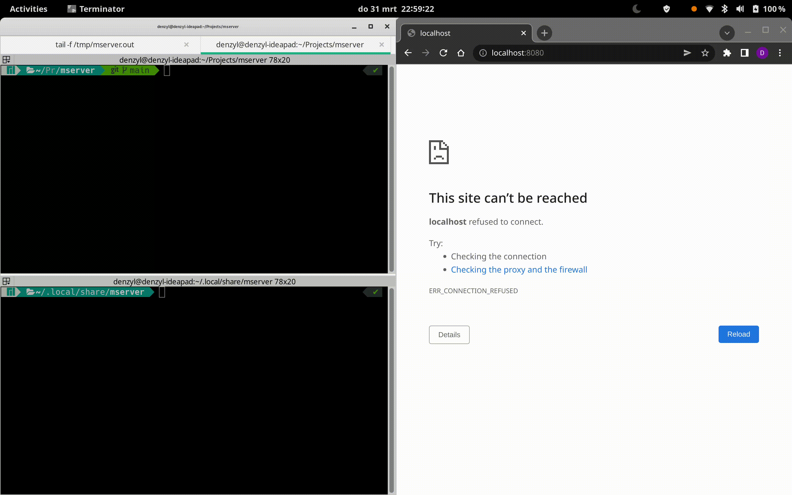

# MServer

Serve your markdown files to the internet. Just execute a binary inside a folder containing markdown files, and they
will automatically be served by a build in web-server.

## Build it yourself.

1. Install the rust toolchain.
2. Build using cargo.
3. Run the executable.

### Todo

- [ ] Add HTTPS support.
- [x] Extract hardcoded configuration to a configuration file.
- [ ] Add an PKGBUILD script for arch based distros.
- [ ] Update the configuration file if there missing fields.
- [x] Use the current path as working directory and skip the whole default configuration path.
- [ ] Make it possible to inject CSS, Javascript.
- [ ] Read title from the configuration and remove the hardcoded title.
- [ ] Configuration available at runtime without IO in the middle.
